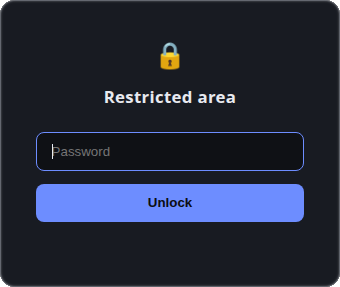

# bouncer.php 🔒

**A minimalist, single-file, password-gated file drop.** Share direct links
(`https://your-domain.com/archive.zip`) behind one password: no listing, no
leaks, no database, no dependencies.

[](https://php.net)
[](LICENSE)
[](https://owasp.org/www-project-top-ten/)
[](#tests)

<p align="center">
  
</p>

## How it works

Every request to the domain is intercepted by `index.php` and gated behind a
password prompt. Only after unlocking can the visitor download the exact file
named in their link — the download then starts automatically. Directory listing
is impossible: no file is ever served directly by the web server, so the
contents of the drop folder are never exposed or enumerable.

- 🔑 One shared password (bcrypt-hashed), session ends with the browser
- 📁 Drop any file into `files/` — it's shareable instantly, subfolders included
- 🎬 Media plays in the browser, everything else downloads
- 🛡️ CSRF token, per-IP lockout, strict security headers, traversal-proof
- 📄 One PHP file + one folder. No database, no frameworks, no CDN

## Quick start

1. Drop `index.php` (and `.htaccess` on Apache) into the webroot of your domain.
2. Set your own password — generate a hash and replace `PASS_HASH` in `index.php`:
   ```bash
   php -r "echo password_hash('your-password', PASSWORD_DEFAULT), PHP_EOL;"
   ```
   (The default hash is for the password `exchange-demo` — change it.)
3. Put downloadable files into `files/` next to it (auto-created on first run).
4. Share links as `https://<domain>/<filename>`. Visitors see the gate first;
   after unlocking, the same link starts the download.

Subfolders of any depth work too: a file at `files/videos/birthday/1.mp4` is
shared as `https://<domain>/videos/birthday/1.mp4`. Paths are resolved with
`realpath()` and must stay contained inside `files/` — `..` traversal and
symlink escapes return 404.

## Web server notes

- **Apache:** the included `.htaccess` routes all requests through `index.php`
  and blocks direct access to `files/` (requires `mod_rewrite`, `AllowOverride`).
- **nginx:** route everything through the front controller instead:
  ```nginx
  location / { try_files $uri /index.php$is_args$args; }
  location ^~ /files/ { deny all; }
  ```

## Playback vs. download

Common media files (mp3, wav, ogg, m4a, flac, mp4, mkv, webm, mov, pdf, jpg,
png, gif, webp, svg — see `INLINE_EXT` in `index.php`) are served with
`Content-Disposition: inline`, so the browser plays or renders them directly
when it supports the type; unsupported types fall back to download. All other
files (zip, docx, …) are served as `attachment` and always download. This is
purely a UX choice, not a protection difference: anyone who can play a file
can also save it (right-click → "Save as…"). Edit `INLINE_EXT` to tune which
extensions play inline.

Files are streamed with **HTTP Range support** (`206 Partial Content`):
browsers fetch video/audio in byte chunks, so seeking, resuming, and long
playbacks work without one long-lived connection (prevents mid-playback
"network error" aborts). Note: browsers mute autoplaying video until a user
click (autoplay policy), and MKV audio codecs (AC3/DTS) often can't be
decoded by browsers — prefer MP4 (H.264 + AAC) for reliable playback.

## Protection layers

- Password stored only as a **bcrypt hash** — the plaintext never appears in the code.
- **CSRF protection:** the login form carries a per-session token (`random_bytes`),
  verified with timing-safe `hash_equals()`. Mismatches get 403 and do not count
  toward the lockout.
- **Brute-force lockout:** after 5 failed logins from one IP, further attempts are
  blocked for 15 minutes (`MAX_FAILS` / `LOCKOUT_SEC` in `index.php`). Attempts are
  counted in `files/.fails.json` (never served; dotfiles are blocked) and reset on
  successful login. A 2-second delay on each failure slows guessing further.
- Session auth with hardened cookie (HttpOnly, **SameSite=Strict**, Secure on HTTPS),
  session ID regenerated on login. Access ends when the browser closes.
- **Security headers on the gate page:** strict `Content-Security-Policy`
  (`default-src 'none'` — the page is fully self-contained), `X-Frame-Options: DENY`
  (clickjacking), `Referrer-Policy: no-referrer`, `X-Content-Type-Options: nosniff`.
- **Header-injection safe:** filenames in `Content-Disposition` are stripped of
  control characters, quotes, and backslashes (HTTP response-splitting proof).
- Path-traversal safe: `realpath()` containment check inside `files/`; `..`,
  encoded variants, and symlink escapes return 404. Dotfiles are never served.
- `display_errors` is off — PHP warnings never leak server internals to the page.
- `files/` and its protective `.htaccess` are auto-created on first run if missing.
- Files served with `no-store` and `nosniff` headers.
- `noindex,nofollow` meta to keep the gate out of search engines.

## Tests

A self-contained black-box test suite lives in `tests/run.php` (no dependencies
beyond PHP CLI with curl). It boots a throwaway copy of the app on the built-in
web server and asserts the crucial behavior over HTTP: the gate, CSRF, security
headers, login → auto-download flow, inline vs. attachment, nested/URL-encoded
paths, HTTP Range streaming, traversal/dotfile protection, filename
sanitization, and the brute-force lockout lifecycle. Your real `files/` folder
is never touched.

```bash
php tests/run.php
```

Exits 0 when all checks pass (currently 44), 1 with a failure list otherwise.
The suite expects the default demo password hash to be in place; if you changed
`PASS_HASH`, update `DEMO_PW` in `tests/run.php` accordingly.

## Limitations (by design)

- One shared password for all links. For per-link tokens or expiry, extend the
  login check with a token map.
- The lockout is per-IP; an attacker rotating through many IPs (botnet) bypasses
  it. For high-exposure setups, add fail2ban or nginx `limit_req` on top.
- Use HTTPS in production — the password is only as safe as the transport.

## License

[GPL-3.0](LICENSE)
